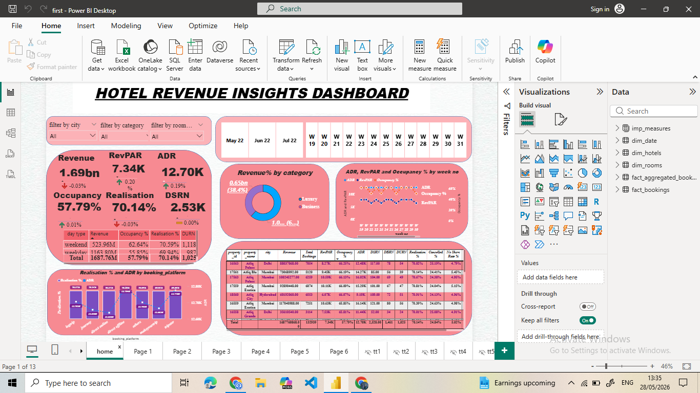

# 🏨 Hotel Revenue Insights Dashboard

## 📌 Project Overview

Hotel Revenue Insights Dashboard is an interactive Business Intelligence project developed using Power BI to analyze hotel performance and revenue trends. The dashboard provides valuable insights into key hospitality metrics such as Revenue, Occupancy Rate, ADR (Average Daily Rate), RevPAR (Revenue per Available Room), Realisation Percentage, and DSRN.

The project enables hotel management teams to monitor performance, identify business trends, and make data-driven decisions to improve revenue and operational efficiency.

## 🎯 Objectives

* Analyze hotel revenue performance.
* Track occupancy and booking trends.
* Monitor ADR and RevPAR metrics.
* Compare revenue across hotel categories.
* Evaluate booking platform performance.
* Support strategic business decision-making.

## 🛠️ Tools & Technologies

* Microsoft Power BI
* Power Query
* DAX (Data Analysis Expressions)
* Data Modeling
* Data Visualization

## 📊 Dashboard Features

### Revenue Analysis

* Total Revenue Generated
* Revenue by Category
* Revenue Trends Analysis

### Occupancy Analysis

* Occupancy Percentage
* Weekly Occupancy Tracking

### Performance Metrics

* ADR (Average Daily Rate)
* RevPAR (Revenue per Available Room)
* DSRN (Daily Sellable Room Nights)
* Realisation Percentage

### Booking Platform Analysis

* Platform-wise Revenue Contribution
* ADR Comparison
* Booking Source Performance

### Interactive Filters

* City Filter
* Category Filter
* Room Class Filter
* Week-wise Analysis

## 📈 Key Performance Indicators (KPIs)

* Revenue
* Occupancy %
* ADR
* RevPAR
* Realisation %
* DSRN
* Booking Performance
* Category-wise Revenue Distribution

## Dashboard Preview


## 📁 Project Structure

```text id="hotelrev001"
HOTEL-REVENUE-INSIGHTS-DASHBOARD/
│
├── Dashboard.pbix
├── Dataset.xlsx
├── Screenshots/
│   └── dashboard.png
└── README.md
```

## 🔍 Insights Generated

* Revenue performance across hotel categories.
* Occupancy trends and booking patterns.
* Comparison of ADR and RevPAR metrics.
* Booking platform effectiveness analysis.
* City-wise and room class-wise performance evaluation.
* Business vs Luxury category contribution analysis.

## 🚀 Business Benefits

* Improves revenue monitoring and reporting.
* Enables faster data-driven decision-making.
* Helps identify underperforming business segments.
* Supports forecasting and strategic planning.
* Enhances overall operational efficiency.

## 🔮 Future Enhancements

* Real-Time Data Integration
* Predictive Revenue Forecasting
* Executive-Level Interactive Dashboards
* Customer Segmentation Analysis
* Advanced Power BI Visualizations

## 👩‍💻 Author

**Jagriti Roy**

Aspiring Data Analyst | Power BI | SQL | Excel | Python

GitHub: https//github.com/jagritiroy3

## ⭐ Acknowledgement

If you found this project useful, consider giving it a star on GitHub.


